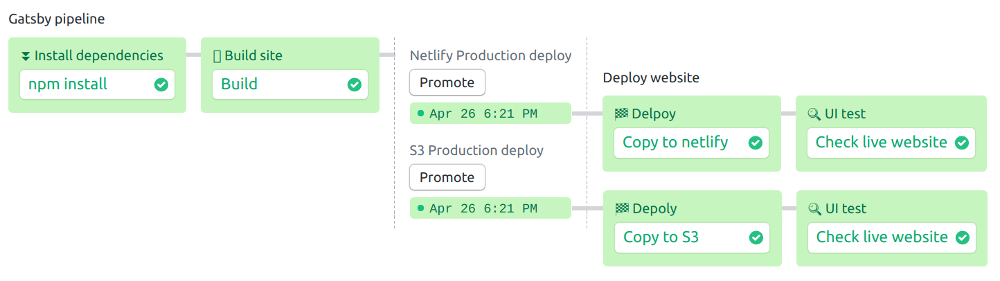

# Semaphore demo CI/CD pipeline using Gatsby.js

Example application and CI/CD pipeline showing how to deploy a static website
to S3 and Netlify on Semaphore 2.0.

In this demo we're using Gatsby.js blog. We're starting from the [Gatsby starter blog](https://github.com/gatsbyjs/gatsby-starter-blog) template.

## CI/CD on Semaphore

Fork this repository and use it to [create a
project](https://docs.semaphoreci.com/article/63-your-first-project).

Populate each secret as shown in ./.semaphore/secrets/*.sample.yml

The CI pipeline will look like this:




The example pipeline contains 2 blocks and 2 promotions:

 - Install Dependencies
    - installs and caches all npm dependencies.
 - Build site
    - Runs npm build.
    - Stores website files of "public" in cache.

If all steps are ok, we move to the deployment pipelines. It consists of two promotions:

 - Deploy to S3:
    - Deploys website files to S3 bucket which is specified in secret.
 - Deploy to Netlify
    - Deploys website files to Netlify site.

## Local project setup
```
npm install
npm run start
npm run nightwatch
```
## Related links
For a full step-by-step guide, read the [article on dev.to](https://dev.to/markoa/introduction-to-continuous-integration-and-delivery-with-semaphore-20-3k0m).

## License

Copyright (c) 2019 Rendered Text

Distributed under the MIT License. See the file [LICENSE.md](./LICENSE.md).
